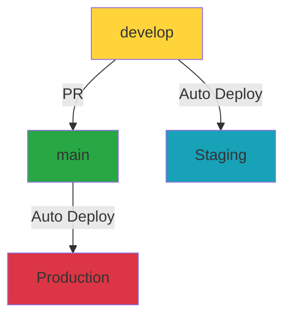
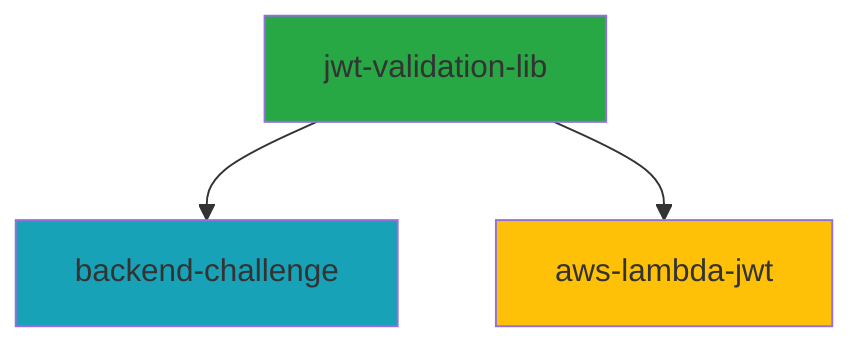

# JWT Validation Project - CI/CD Architecture

Este projeto implementa uma arquitetura completa de **pipelines independentes** usando GitHub Actions para:

- 📦 **JWT Validation Library** (biblioteca compartilhada)
- 🚀 **Backend API** (Spring Boot)
- ⚡ **AWS Lambda** (função serverless)

## 🏗️ Arquitetura de Pipelines

### **1. Pipeline Independente por Componente**

Cada componente possui seu próprio workflow com **path filters** inteligentes:

```yaml
# Exemplo de path filter
on:
  push:
    paths:
      - 'jwt-validation-lib/**'  # Executa apenas para mudanças na lib
      - 'backend-challenge/**'   # Executa apenas para mudanças na API
      - 'aws-lambda-jwt/**'      # Executa apenas para mudanças no Lambda
```

### **2. Workflows Criados**

| Workflow | Arquivo | Trigger | Função |
|----------|---------|---------|--------|
| **JWT Library** | `.github/workflows/jwt-validation-lib.yml` | Mudanças em `jwt-validation-lib/` | Build, test e publish da biblioteca |
| **Backend API** | `.github/workflows/backend-api.yml` | Mudanças em `backend-challenge/` | Build, test, Docker e deploy da API |
| **AWS Lambda** | `.github/workflows/aws-lambda.yml` | Mudanças em `aws-lambda-jwt/` | Build, test e deploy do Lambda |
| **Monitoring** | `.github/workflows/monitoring.yml` | Schedule (5 min) | Monitoramento contínuo |

## 🚀 Fluxo de Deploy

### **Branch Strategy**



- **`develop`** → Deploy automático para **Staging**
- **`main`** → Deploy automático para **Production**

### **Dependency Flow**



## 📦 Estratégia de Build

### **1. JWT Validation Library**

```yaml
# Sempre buildar primeiro (é dependência)
- name: Build JWT Validation Library
  run: |
    cd jwt-validation-lib
    mvn clean install -DskipTests -B
```

### **2. Backend API**

```yaml
# Multi-stage Docker build otimizado
- name: Build and push Docker image
  uses: docker/build-push-action@v5
  with:
    context: backend-challenge
    platforms: linux/amd64,linux/arm64
    cache-from: type=gha
    cache-to: type=gha,mode=max
```

### **3. AWS Lambda**

```yaml
# Package com versionamento automático
- name: Build Lambda package
  run: |
    TIMESTAMP=$(date +%Y%m%d-%H%M%S)
    COMMIT_SHA=$(echo ${{ github.sha }} | cut -c1-7)
    LAMBDA_ZIP="jwt-lambda-${TIMESTAMP}-${COMMIT_SHA}.zip"
```

## 🔧 Configuração Necessária

### **GitHub Secrets**

#### **AWS (para Lambda)**
```
AWS_ACCESS_KEY_ID
AWS_SECRET_ACCESS_KEY
LAMBDA_FUNCTION_NAME_STAGING
LAMBDA_FUNCTION_NAME_PROD
LAMBDA_DEPLOYMENT_BUCKET
```

#### **Backend API**
```
BACKEND_API_URL
DOCKER_REGISTRY_USERNAME
DOCKER_REGISTRY_PASSWORD
```

#### **Monitoramento**
```
SLACK_WEBHOOK_URL
TEST_VALID_JWT
```

### **GitHub Environments**

Configure environments no GitHub:

1. **staging** - Aprovação automática
2. **production** - Aprovação manual obrigatória

## 🏃‍♂️ Como Usar

### **Deploy Automático**

1. **Commit para `develop`**:
   ```bash
   git checkout develop
   git add jwt-validation-lib/
   git commit -m "feat: nova validação de JWT"
   git push origin develop
   ```
   → **Resultado**: Deploy automático para staging

2. **Merge para `main`**:
   ```bash  
   git checkout main
   git merge develop
   git push origin main
   ```
   → **Resultado**: Deploy automático para production (após aprovação)

### **Deploy Manual**

Trigger manual via GitHub Actions UI:
- Acesse **Actions** → Escolha o workflow → **Run workflow**

## 📊 Monitoramento

### **Monitoramento Automático (a cada 5 minutos)**

- ✅ Health check das APIs
- ✅ Test de funcionalidade JWT
- ✅ Métricas do CloudWatch
- ✅ Alertas via Slack
- ✅ Testes de performance

### **Métricas Coletadas**

| Componente | Métricas |
|------------|----------|
| **Lambda** | Duration, Errors, Invocations, Memory |
| **API** | HTTP Status, Response Time, Database |
| **Library** | Test Coverage, Build Success |

## 🔄 Otimizações Implementadas

### **Cache Inteligente**

```yaml
# Cache de dependências Maven
- uses: actions/cache@v3
  with:
    path: ~/.m2
    key: ${{ runner.os }}-m2-${{ hashFiles('**/pom.xml') }}
```

### **Builds Paralelos**

- Workflows executam **independentemente**
- Docker builds com **multi-stage** otimizado
- **Path filters** evitam builds desnecessários

### **Segurança**

- ✅ Container images **sem root**
- ✅ Vulnerability scanning com **Trivy**
- ✅ Secrets management adequado
- ✅ SARIF reports no GitHub Security

## 🎯 Vantagens da Arquitetura

| Vantagem | Descrição |
|----------|-----------|
| **🔀 Independência** | Pipelines executam apenas quando necessário |
| **⚡ Performance** | Builds paralelos e cache otimizado |
| **🛡️ Segurança** | Environments protegidos e scanning automático |
| **📈 Observabilidade** | Monitoramento contínuo e alertas |
| **🔄 Eficiência** | Zero deployments desnecessários |

## 🚦 Pipeline Status

Para verificar o status de todos os pipelines:

```bash
# Ver todos os workflows
gh workflow list

# Ver runs de um workflow específico  
gh run list --workflow="Backend API CI/CD"

# Ver logs de uma run
gh run view <run-id> --log
```

---

## 🎉 Resultado Final

✅ **3 Pipelines Independentes**  
✅ **Deploy Automático Multi-Environment**  
✅ **Monitoramento 24/7**  
✅ **Zero Downtime Deployments**  
✅ **Segurança e Compliance**

Esta arquitetura garante **máxima eficiência** e **confiabilidade** para o ecossistema JWT completo! 🚀 